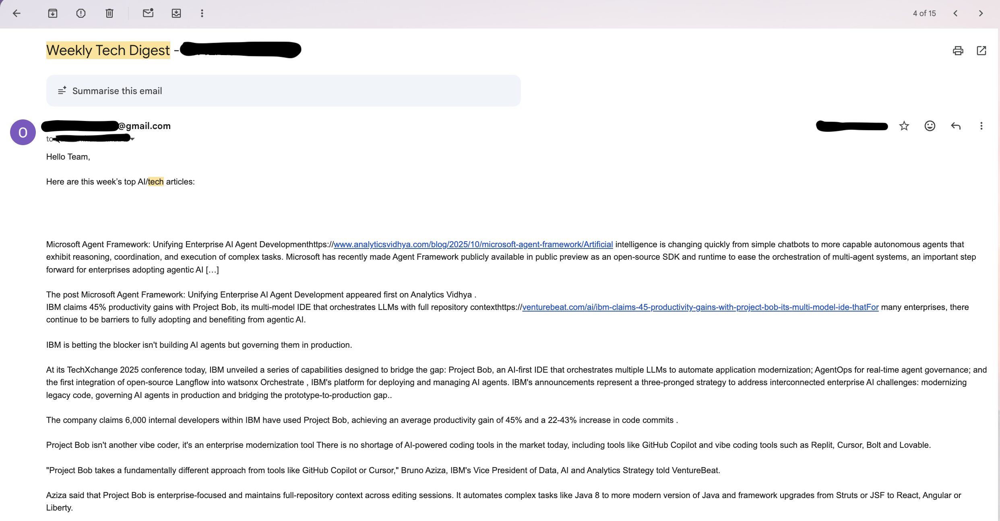

# SmartFeed Automation

SmartFeed is an automated content ingestion and filtering pipeline built using RSS feeds, keyword-based filtering, and Zapier workflow orchestration.  
It collects AI/tech articles across multiple sources, filters out irrelevant content, generates weekly digests, and emails them automatically.

---

## 🚀 Overview

Manual content discovery across multiple sites is slow and inconsistent.  
SmartFeed solves this by automating:

1. **Collection** of new articles from multiple RSS feeds  
2. **Filtering** using keyword logic  
3. **Aggregation** into a weekly digest  
4. **Delivery** via scheduled email  

This produces a clean, curated summary of AI/tech articles without any manual work.

---

## 🧩 Architecture

```
RSS Feeds  
   ↓  
Collector Zap (Triggers every 15 min)  
   ↓  
Filter (Keywords for AI/tech)  
   ↓  
Digest Build (Append & schedule weekly digest)  
   ↓  
Sender Zap (Weekly trigger)  
   ↓  
Release Digest  
   ↓  
Email Delivery
```

---

## ⚙️ Zapier Workflows

### **Collector Zap**
Fetches new items from multiple RSS feeds, filters them using AI/tech keywords, and appends relevant items to a weekly digest.

<p align="center">
  
</p>

---

### **Sender Zap**
Runs weekly to release the compiled digest and email it to subscribers.

<p align="center">
  
</p>

---

## 📬 Example Output (Weekly Digest Email)

Below is an example of the automatically generated email digest.  
Personal details and timestamps are masked for privacy.

<p align="center">
  
</p>

---

## 🛠️ Features

- Multi-source RSS ingestion  
- Keyword-based relevance filtering  
- Deduplicated article collection  
- Automated weekly digest generation  
- Email delivery via Gmail Zap  
- Zero-code pipeline using Zapier workflows  

---

## 📚 Learnings

- Designing reliable no-code automation pipelines  
- Handling RSS inconsistencies and missing metadata  
- Chaining Zaps to form multi-step workflows  
- Troubleshooting timing delays and filter edge-cases  

---

## 📈 Future Improvements

- Add Python data cleaning layer  
- Store digests in a database (Mongo/Postgres)  
- Build a web dashboard to browse past digests  
- Add sentiment scoring or topic classification  

---

## 📎 Project Structure

```
assets/
  ├── Collector Zap - v3.png
  ├── Sender Zap - v5.png
  └── digest-example.png
README.md
```

---

If you'd like to see how this works or want help building your own automation pipeline, feel free to reach out or open an issue.
